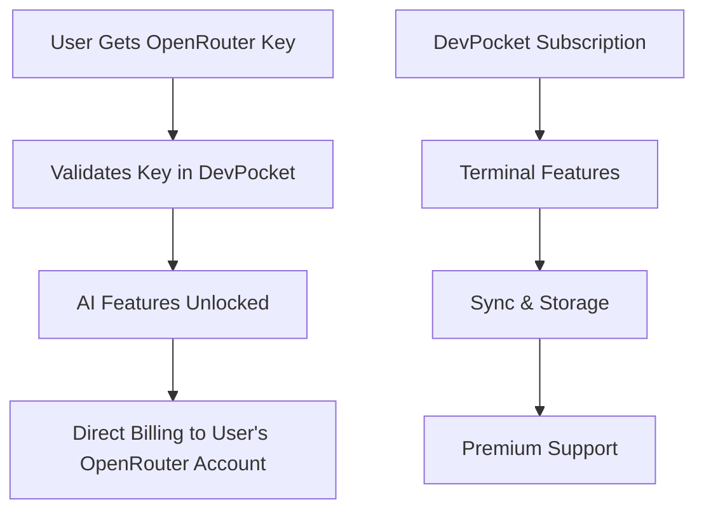
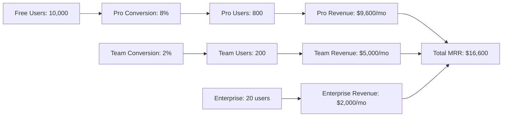
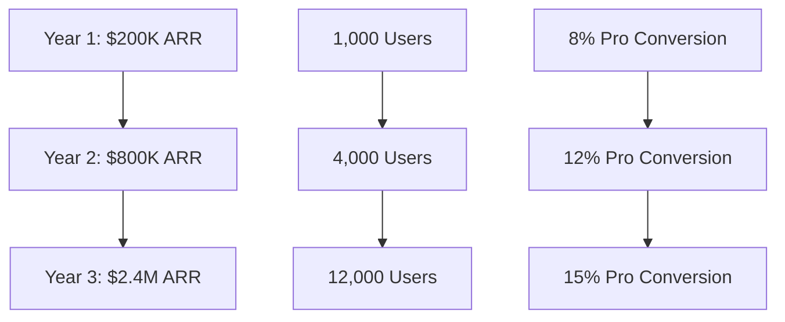

# DevPocket Business Model & Subscription Tiers

## Overview

DevPocket operates on a freemium business model with a unique **Bring Your Own Key (BYOK)** approach for AI services. This model provides high gross margins (85-98%) while offering transparent, cost-effective AI features to users.

## BYOK (Bring Your Own Key) Model

### Core Concept

Instead of reselling AI services at marked-up rates, DevPocket uses a BYOK model where users provide their own OpenRouter API keys for AI functionality. This approach offers several advantages:

#### For Users
- **Transparent Pricing**: Pay OpenRouter directly at cost (typically $0.001-0.01 per request)
- **No AI Markup**: Avoid 300-500% markups common in other services
- **Usage Control**: Direct control over AI spending and usage limits
- **Provider Choice**: Access to 100+ AI models through OpenRouter
- **Privacy**: Your API key, your data ownership

#### For DevPocket
- **High Margins**: 85-98% gross margins on subscription revenue
- **Scalable**: No AI infrastructure costs or rate limiting concerns
- **Sustainable**: Predictable revenue without variable AI costs
- **Competitive**: Can offer AI features at lower total cost than competitors

### BYOK Implementation



#### Getting Started with BYOK

1. **Obtain OpenRouter API Key**
   - Visit [openrouter.ai](https://openrouter.ai)
   - Create account and generate API key
   - Add credits to your OpenRouter account

2. **Validate Key in DevPocket**
   ```bash
   POST /api/ai/validate-key
   Content-Type: application/json
   Authorization: Bearer YOUR_JWT_TOKEN
   
   {
     "openrouter_api_key": "sk-or-v1-xxx"
   }
   ```

3. **Use AI Features**
   - Command suggestions
   - Error analysis and solutions
   - Natural language to command translation
   - Code explanation and optimization

#### Cost Examples

| AI Feature | OpenRouter Cost | Traditional Service | Savings |
|------------|----------------|-------------------|---------|
| Command Suggestion | $0.001 | $0.05 | 98% |
| Error Analysis | $0.002 | $0.10 | 98% |
| Code Review | $0.005 | $0.25 | 98% |
| Documentation | $0.008 | $0.40 | 98% |

*Costs based on average request complexity and current OpenRouter pricing*

## Subscription Tiers

### Free Tier (7-Day Trial)

**Price**: Free for 7 days, then $0/month (with limitations)

**Features**:
- ✅ Core terminal functionality
- ✅ SSH connections (up to 3 profiles)
- ✅ BYOK AI features (unlimited with valid key)
- ✅ Local command history
- ✅ Basic terminal customization
- ✅ WebSocket real-time communication
- ❌ Multi-device synchronization
- ❌ Cloud command history
- ❌ Advanced terminal themes
- ❌ Priority support

**Target Users**: Developers trying DevPocket, personal use, light usage

**API Access**:
```json
{
  "tier": "free",
  "ssh_profiles_limit": 3,
  "cloud_sync": false,
  "history_retention_days": 0,
  "ai_features": "byok_only",
  "support_level": "community"
}
```

### Pro Tier

**Price**: $12/month or $120/year (17% savings)

**Features**:
- ✅ Everything in Free
- ✅ Unlimited SSH profiles
- ✅ Multi-device synchronization
- ✅ Cloud command history (90 days)
- ✅ Advanced terminal themes and customization
- ✅ Session recording and playback
- ✅ AI command caching (reduces OpenRouter costs)
- ✅ Priority email support
- ✅ Export/import configurations
- ✅ Advanced search and filtering

**Target Users**: Professional developers, freelancers, individual power users

**API Access**:
```json
{
  "tier": "pro",
  "ssh_profiles_limit": -1,
  "cloud_sync": true,
  "history_retention_days": 90,
  "ai_features": "byok_with_caching",
  "support_level": "priority_email",
  "session_recording": true,
  "advanced_themes": true
}
```

### Team Tier

**Price**: $25/user/month or $250/user/year (17% savings)

**Features**:
- ✅ Everything in Pro
- ✅ Team workspaces and shared configurations
- ✅ Shared SSH profiles and credentials
- ✅ Team command library and templates
- ✅ Activity monitoring and audit logs
- ✅ Role-based access control
- ✅ Team AI usage analytics
- ✅ Extended history retention (1 year)
- ✅ Phone and chat support
- ✅ Custom onboarding and training

**Target Users**: Development teams, small to medium businesses

**API Access**:
```json
{
  "tier": "team",
  "ssh_profiles_limit": -1,
  "cloud_sync": true,
  "history_retention_days": 365,
  "ai_features": "byok_with_team_analytics",
  "support_level": "phone_chat",
  "team_features": true,
  "audit_logs": true,
  "rbac": true
}
```

### Enterprise Tier

**Price**: Custom pricing (starts at $100/user/month)

**Features**:
- ✅ Everything in Team
- ✅ Single Sign-On (SSO) integration
- ✅ Advanced security controls and compliance
- ✅ Custom API rate limits and SLAs
- ✅ On-premises deployment options
- ✅ Custom integrations and development
- ✅ Unlimited history retention
- ✅ Dedicated customer success manager
- ✅ 99.9% uptime SLA
- ✅ Custom training and workshops

**Target Users**: Large enterprises, organizations with compliance requirements

**API Access**:
```json
{
  "tier": "enterprise",
  "ssh_profiles_limit": -1,
  "cloud_sync": true,
  "history_retention_days": -1,
  "ai_features": "byok_with_enterprise_analytics",
  "support_level": "dedicated_csm",
  "sso": true,
  "compliance": true,
  "custom_sla": true,
  "on_premises": true
}
```

## Pricing Strategy

### Market Positioning

DevPocket positions itself as a **premium but accessible** solution in the developer tools market:

| Competitor | Monthly Price | AI Cost | Total Cost | DevPocket Advantage |
|------------|---------------|---------|------------|-------------------|
| Traditional Terminal Pro | $20 | $30-50 | $50-70 | 60-75% savings |
| AI Code Assistant | $25 | Included | $25 | More features, better value |
| Cloud IDE Pro | $50 | $20-40 | $70-90 | 80-85% savings |
| **DevPocket Pro** | **$12** | **$2-5** | **$14-17** | **Best value** |

### Value Proposition

1. **Cost Transparency**: Users know exactly what they pay for AI
2. **Feature Completeness**: Full-featured terminal with AI integration
3. **No Vendor Lock-in**: Users own their AI keys and data
4. **Scalable Pricing**: Grows with user needs and usage

### Revenue Projections

Based on SaaS industry benchmarks:



**Year 1 Projection**:
- **Monthly Recurring Revenue (MRR)**: $16,600
- **Annual Recurring Revenue (ARR)**: $199,200
- **Gross Margin**: 92% (after payment processing and infrastructure)

## API Billing Integration

### Subscription Management

DevPocket integrates with Stripe for subscription management:

#### Check User Subscription
```bash
GET /api/profile/subscription
Authorization: Bearer YOUR_JWT_TOKEN

Response:
{
  "subscription": {
    "tier": "pro",
    "status": "active",
    "current_period_start": "2023-01-01T00:00:00Z",
    "current_period_end": "2023-02-01T00:00:00Z",
    "cancel_at_period_end": false,
    "features": {
      "ssh_profiles_limit": -1,
      "cloud_sync": true,
      "ai_caching": true,
      "priority_support": true
    }
  }
}
```

#### Upgrade Subscription
```bash
POST /api/profile/subscription/upgrade
Authorization: Bearer YOUR_JWT_TOKEN
Content-Type: application/json

{
  "new_tier": "team",
  "billing_cycle": "annual"
}

Response:
{
  "checkout_url": "https://checkout.stripe.com/pay/xxx",
  "session_id": "cs_xxx"
}
```

#### Usage Analytics
```bash
GET /api/profile/usage
Authorization: Bearer YOUR_JWT_TOKEN

Response:
{
  "current_period": {
    "ai_requests": 245,
    "ssh_connections": 89,
    "cloud_sync_operations": 1250,
    "storage_used_mb": 45.2
  },
  "limits": {
    "ai_requests": -1,
    "ssh_profiles": -1,
    "storage_mb": 1000
  },
  "ai_cost_estimate": {
    "openrouter_cost": 2.45,
    "cache_savings": 0.85,
    "projected_monthly": 7.35
  }
}
```

### Feature Gating

The API implements feature gating based on subscription tiers:

```python
# Example endpoint with tier checking
@router.get("/ssh/profiles")
async def list_ssh_profiles(
    current_user: User = Depends(get_current_user),
    db: AsyncSession = Depends(get_db)
):
    # Check subscription tier
    subscription = await get_user_subscription(current_user.id, db)
    
    profiles = await get_ssh_profiles(current_user.id, db)
    
    # Apply tier limits
    if subscription.tier == "free":
        profiles = profiles[:3]  # Limit to 3 profiles
    
    return {
        "profiles": profiles,
        "tier_info": {
            "current_tier": subscription.tier,
            "limit": 3 if subscription.tier == "free" else -1,
            "usage": len(profiles)
        }
    }
```

## Customer Success Strategy

### Onboarding Flow

1. **Free Trial Start**
   - Immediate access to all Pro features for 7 days
   - Interactive tutorial and setup wizard
   - Personal onboarding email sequence

2. **Value Demonstration**
   - Track feature usage and engagement
   - Send usage reports showing value delivered
   - Highlight BYOK cost savings

3. **Conversion Optimization**
   - In-app upgrade prompts based on usage patterns
   - Email campaigns with conversion incentives
   - Customer success check-ins

### Retention Strategies

1. **Feature Adoption**
   - Track and encourage usage of premium features
   - Send tips and best practices
   - Feature spotlight campaigns

2. **Cost Transparency**
   - Monthly AI cost reports
   - Comparison with traditional AI services
   - Optimization recommendations

3. **Community Building**
   - Developer community and forums
   - User-generated content and tutorials
   - Regular product updates and roadmap sharing

## Competitive Analysis

### Direct Competitors

| Feature | DevPocket | Competitor A | Competitor B | Competitor C |
|---------|-----------|--------------|--------------|--------------|
| Base Price | $12/mo | $20/mo | $25/mo | $19/mo |
| AI Features | BYOK | Included | $15/mo extra | Included |
| SSH Management | ✅ | ✅ | ❌ | ✅ |
| Multi-device Sync | ✅ | ✅ | ✅ | ❌ |
| Team Features | $25/user | $50/user | $40/user | $30/user |
| Mobile App | ✅ | ❌ | ❌ | ✅ |
| **Total Cost** | **$14-17/mo** | **$35-55/mo** | **$40-65/mo** | **$19-49/mo** |

### Competitive Advantages

1. **BYOK Model**: Unique in the market, provides transparency and cost savings
2. **Mobile-First**: Optimized for mobile terminal usage
3. **Integrated Platform**: Combines terminal, AI, and team features
4. **Cost Efficiency**: Significantly lower total cost of ownership

## Financial Projections

### 3-Year Growth Model



**Detailed Projections**:

| Metric | Year 1 | Year 2 | Year 3 |
|--------|---------|---------|---------|
| **Users** |
| Total Users | 10,000 | 40,000 | 120,000 |
| Free Users | 9,200 | 35,200 | 102,000 |
| Pro Users | 800 | 4,800 | 18,000 |
| Team Users | 200 | 800 | 2,400 |
| Enterprise Users | 20 | 80 | 240 |
| **Revenue** |
| Pro Revenue | $115K | $691K | $2.16M |
| Team Revenue | $60K | $240K | $720K |
| Enterprise Revenue | $24K | $96K | $288K |
| **Total ARR** | **$199K** | **$1.03M** | **$3.17M** |
| **Metrics** |
| Customer LTV | $420 | $450 | $480 |
| CAC | $35 | $40 | $45 |
| LTV:CAC Ratio | 12:1 | 11:1 | 11:1 |
| Gross Margin | 92% | 94% | 95% |

### Key Success Metrics

1. **Growth Metrics**
   - Monthly Active Users (MAU)
   - Trial to paid conversion rate
   - Monthly Recurring Revenue (MRR) growth
   - Customer Acquisition Cost (CAC)

2. **Engagement Metrics**
   - Daily Active Users (DAU)
   - Session duration and frequency
   - Feature adoption rates
   - AI usage patterns

3. **Financial Metrics**
   - Customer Lifetime Value (LTV)
   - Churn rate by tier
   - Average Revenue Per User (ARPU)
   - Gross margin and unit economics

## Implementation Roadmap

### Phase 1: Foundation (Months 1-3)
- ✅ Core API and authentication
- ✅ Basic subscription tiers
- ✅ BYOK AI integration
- ✅ Stripe billing integration

### Phase 2: Growth (Months 4-6)
- 🔄 Team features and collaboration
- 🔄 Advanced analytics and reporting
- 🔄 Mobile app release
- 🔄 Customer success automation

### Phase 3: Scale (Months 7-12)
- 📅 Enterprise features and SSO
- 📅 Advanced security and compliance
- 📅 Partner integrations
- 📅 International expansion

### Phase 4: Expansion (Year 2+)
- 📅 Additional AI providers beyond OpenRouter
- 📅 Custom AI model training
- 📅 Marketplace for terminal plugins
- 📅 Enterprise on-premises solutions

## Risk Mitigation

### Business Risks

1. **OpenRouter Dependency**
   - **Risk**: Single AI provider dependency
   - **Mitigation**: Support multiple AI providers, maintain OpenRouter partnership

2. **Market Competition**
   - **Risk**: Large tech companies entering market
   - **Mitigation**: Focus on mobile-first approach, build strong community

3. **Pricing Pressure**
   - **Risk**: Competitors lowering prices
   - **Mitigation**: BYOK model provides sustainable cost advantage

### Technical Risks

1. **API Rate Limits**
   - **Risk**: OpenRouter or other service limits
   - **Mitigation**: Multiple provider support, caching, usage optimization

2. **Scalability Challenges**
   - **Risk**: Infrastructure costs at scale
   - **Mitigation**: Efficient architecture, gradual scaling, cost monitoring

3. **Security Concerns**
   - **Risk**: SSH key and credential management
   - **Mitigation**: Industry-standard encryption, security audits, compliance

## Conclusion

DevPocket's BYOK business model offers a unique value proposition in the developer tools market. By combining transparent AI pricing with comprehensive terminal functionality, we can capture significant market share while maintaining high gross margins.

The freemium model with clear upgrade paths ensures sustainable growth, while the focus on mobile-first development addresses an underserved market segment. With proper execution, DevPocket can achieve $3M+ ARR within three years while maintaining industry-leading unit economics.

**Key Success Factors**:
1. Seamless BYOK implementation and user experience
2. Strong mobile app with feature parity
3. Effective onboarding and conversion optimization
4. Continuous product innovation and market differentiation
5. Building a strong developer community and brand

For detailed API integration examples and technical implementation guidance, see the companion documentation files in this repository.