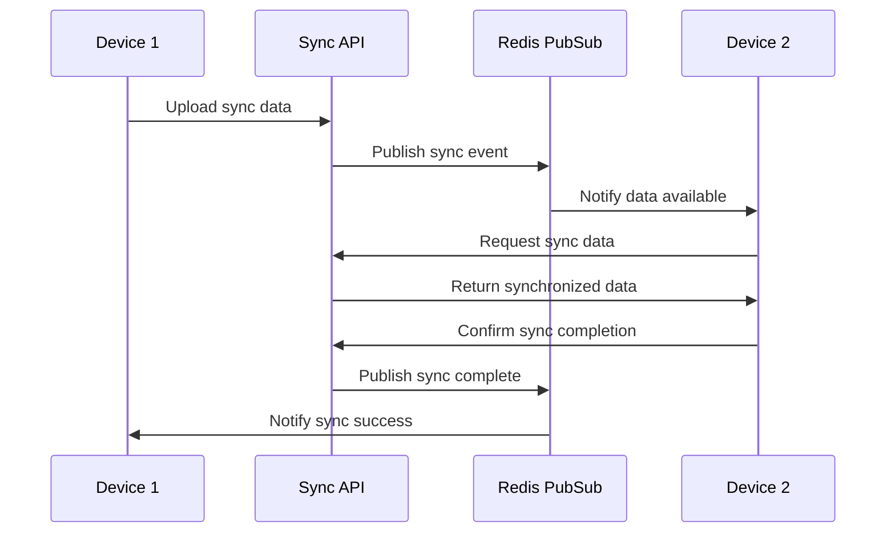

# DevPocket Sync Services Architecture

## Overview

The DevPocket sync services provide comprehensive multi-device synchronization capabilities for users across iOS, Android, and web platforms. The architecture is designed to handle real-time data synchronization, conflict resolution, and seamless user experience across devices.

## Architecture Components

### 1. Sync Service Layer

#### CommandSyncService
- **Purpose**: Synchronizes command history across devices
- **Features**:
  - Command deduplication based on command text and session
  - Timestamp-based conflict resolution
  - Batch processing for efficient sync operations
  - Privacy filtering (excludes commands with sensitive data)

#### SSHProfileSyncService  
- **Purpose**: Synchronizes SSH profiles and connection settings
- **Features**:
  - SSH profile metadata synchronization (host, port, username)
  - SSH key management with secure transmission
  - Private key exclusion for security
  - Connection profile validation

#### SettingsSyncService
- **Purpose**: Synchronizes user settings and preferences
- **Features**:
  - Application preferences (theme, font size, shortcuts)
  - AI model preferences and configurations
  - Terminal customizations
  - Notification settings

### 2. Core Infrastructure

#### PubSubManager
- **Purpose**: Real-time synchronization notifications via Redis
- **Features**:
  - Redis pub/sub for instant device notifications
  - Sync event broadcasting across active devices
  - Connection management and cleanup
  - Message routing and filtering

#### ConflictResolver
- **Purpose**: Handles synchronization conflicts with multiple strategies
- **Strategies**:
  - **Local Priority**: Keep local version, discard remote
  - **Remote Priority**: Accept remote version, discard local
  - **Timestamp-based**: Keep the most recently modified version
  - **Manual Resolution**: Present both versions to user for decision
  - **Merge Strategy**: Intelligent merging of compatible changes

## Data Types and Synchronization

### Synchronized Data Types

1. **SSH Profiles**
   - Connection details (host, port, username)
   - SSH key references (metadata only)
   - Connection preferences and settings
   - Profile organization and tags

2. **Command History**
   - Executed commands with timestamps
   - Exit codes and execution context
   - Working directory information
   - Session association (filtered for privacy)

3. **Application Settings**
   - UI preferences (theme, layout, fonts)
   - Terminal configurations
   - AI model preferences
   - Notification and sync settings

4. **AI Preferences**
   - Preferred AI models and providers
   - Custom prompts and templates
   - AI feature configurations
   - Usage analytics preferences

### Security Considerations

#### SSH Key Security
- **Private keys are NEVER synchronized**
- Only SSH key metadata (fingerprint, name) is synced
- Users must manually configure private keys on each device
- Public key synchronization for convenience only

#### Data Privacy
- Sensitive command filtering (passwords, keys, tokens)
- User data encryption in transit and at rest
- Device-specific authentication tokens
- Sync data isolation between users

#### Authentication & Authorization
- JWT-based authentication for all sync operations
- Device registration and verification
- Subscription tier validation for sync features
- Rate limiting per user and device

## Conflict Resolution Strategies

### Automatic Resolution

1. **Timestamp-based Resolution**
   - Compares modification timestamps
   - Keeps the most recent version
   - Used for settings and preferences

2. **Additive Merging**
   - Combines non-conflicting changes
   - Used for command history and SSH profiles
   - Preserves unique entries from both sources

3. **Field-level Merging**
   - Merges at the field level for complex objects
   - Preserves user intent when possible
   - Used for application settings

### Manual Resolution

When automatic resolution is not possible:
- Present both versions to the user
- Allow selection of preferred version
- Provide merge assistance for complex conflicts
- Store resolution preferences for future conflicts

## Real-time Synchronization

### WebSocket Integration

The sync service integrates with DevPocket's WebSocket infrastructure to provide real-time notifications:

1. **Sync Events**
   - Data available notifications
   - Conflict detection alerts
   - Sync progress updates
   - Device status changes

2. **Message Types**
   - `sync_data_available`: New data ready for sync
   - `sync_conflict`: Manual resolution required
   - `sync_progress`: Operation progress updates
   - `sync_completed`: Sync operation finished
   - `device_status`: Device connection changes

### Notification Flow

## Business Model Integration

### Subscription Tiers

- **Free Tier (7 days)**: Basic sync for current session only
- **Pro Tier ($12/month)**: Full multi-device sync with history
- **Team Tier ($25/user/month)**: Team sync and shared profiles
- **Enterprise**: Custom sync policies and dedicated infrastructure

### Feature Gating

- Sync services validate subscription status before operations
- Free tier users receive upgrade prompts for sync features
- Graceful degradation for expired subscriptions
- Sync data retention based on subscription level

## Performance Optimization

### Efficient Sync Operations

1. **Delta Synchronization**
   - Only sync changed data since last sync
   - Timestamp-based change detection
   - Minimal data transfer for large datasets

2. **Batch Processing**
   - Group multiple sync operations
   - Reduce API calls and overhead
   - Improved user experience with bulk updates

3. **Caching Strategy**
   - Redis caching for frequently accessed sync data
   - Device-specific cache invalidation
   - Optimized cache TTL based on data type

### Scalability Considerations

- Horizontal scaling support with Redis clustering
- Database connection pooling for sync operations
- Rate limiting to prevent abuse
- Monitoring and alerting for sync performance

## API Endpoints

### Core Sync Endpoints

- `GET /api/sync/data` - Retrieve synchronization data
- `POST /api/sync/data` - Upload synchronization data  
- `GET /api/sync/stats` - Get synchronization statistics
- `POST /api/sync/conflicts/{id}/resolve` - Resolve sync conflicts

### Device Management

- `POST /api/devices/register` - Register new device
- `GET /api/devices` - List user devices
- `DELETE /api/devices/{id}` - Deregister device

## Error Handling

### Common Error Scenarios

1. **Network Connectivity Issues**
   - Offline sync queuing
   - Automatic retry with exponential backoff
   - Conflict-free offline changes

2. **Subscription Expired**
   - Graceful sync disabling
   - Data preservation for reactivation
   - Clear user communication

3. **Sync Conflicts**
   - Automatic resolution when possible
   - User notification for manual resolution
   - Conflict history tracking

### Error Codes

- `SYNC_CONFLICT_DETECTED`: Manual resolution required
- `SYNC_SUBSCRIPTION_EXPIRED`: Upgrade required for sync
- `SYNC_RATE_LIMITED`: Too many sync requests
- `SYNC_DEVICE_LIMIT_EXCEEDED`: Maximum devices reached
- `SYNC_DATA_CORRUPTION`: Data integrity issue detected

## Monitoring and Analytics

### Sync Metrics

- Sync operation success/failure rates
- Conflict resolution statistics
- Device sync frequency and patterns
- Data transfer volumes and efficiency

### Health Monitoring

- Redis pub/sub connectivity
- Database sync operation performance
- Device connection status tracking
- Subscription tier compliance

## Future Enhancements

### Planned Features

1. **Selective Sync**
   - User-configurable sync preferences
   - Data type-specific sync controls
   - Bandwidth-aware sync scheduling

2. **Advanced Conflict Resolution**
   - Machine learning-based conflict prediction
   - Smart merge suggestions
   - Conflict pattern learning

3. **Team Sync Features**
   - Shared SSH profile libraries
   - Team command history
   - Collaborative workspace sync

4. **Offline Sync Improvements**
   - Enhanced offline change tracking
   - Conflict-free replicated data types (CRDTs)
   - Improved offline-to-online reconciliation

This comprehensive sync architecture ensures reliable, secure, and efficient multi-device synchronization while supporting DevPocket's business model and providing excellent user experience across all platforms.