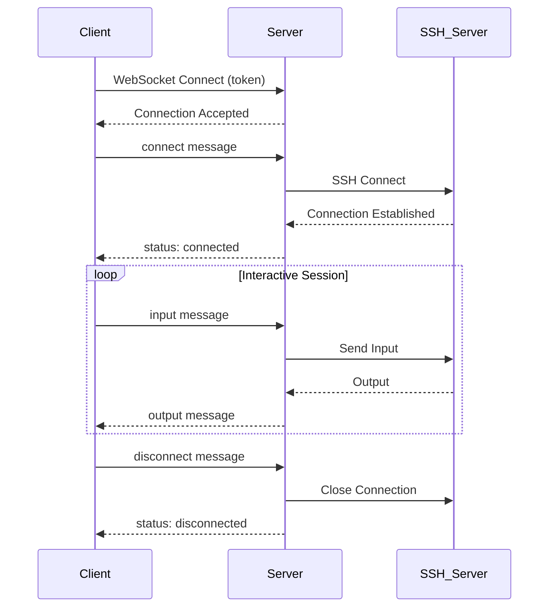
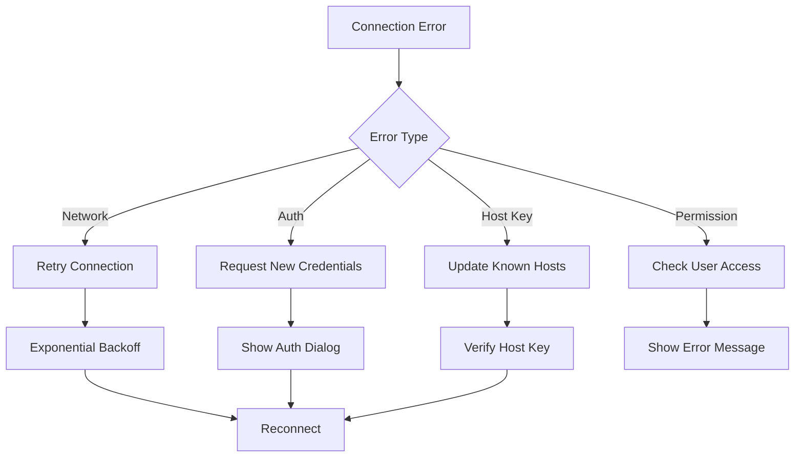

# DevPocket WebSocket Protocol Documentation

## Overview

The DevPocket API provides real-time terminal communication through WebSocket connections. This enables interactive terminal sessions, SSH connections with PTY support, and seamless command execution across devices.

## Connection Establishment

### Endpoint
```
ws://localhost:8000/ws/terminal (Development)
wss://api.devpocket.app/ws/terminal (Production)
```

### Authentication
WebSocket connections require JWT authentication via query parameters:

```javascript
const token = "eyJhbGciOiJIUzI1NiIsInR5cCI6IkpXVCJ9...";
const deviceId = "device-abc123";
const wsUrl = `ws://localhost:8000/ws/terminal?token=${token}&device_id=${deviceId}`;

const websocket = new WebSocket(wsUrl);
```

### Connection Parameters

| Parameter | Required | Type | Description |
|-----------|----------|------|-------------|
| `token` | Yes | string | JWT access token from authentication |
| `device_id` | No | string | Device identifier for session tracking |

## Message Format

All WebSocket messages use JSON format with the following structure:

```json
{
  "type": "message_type",
  "session_id": "optional-session-uuid",
  "data": "message_payload",
  "timestamp": "2023-01-01T12:00:00Z"
}
```

### Common Fields

- **type**: Message type identifier (required)
- **session_id**: Terminal session UUID (required for session-specific messages)
- **data**: Message payload (type-specific)
- **timestamp**: ISO 8601 timestamp (optional, added by server if missing)

## Client-to-Server Messages

### 1. Connect to Session

Establish a connection to a terminal session (SSH, local, or Docker).

```json
{
  "type": "connect",
  "data": {
    "session_type": "ssh",
    "ssh_profile_id": "123e4567-e89b-12d3-a456-426614174000",
    "terminal_size": {
      "rows": 24,
      "cols": 80
    },
    "environment": {
      "TERM": "xterm-256color",
      "LANG": "en_US.UTF-8"
    }
  }
}
```

#### Session Types

| Type | Description | Required Data |
|------|-------------|---------------|
| `ssh` | SSH connection | `ssh_profile_id` |
| `local` | Local terminal | `shell` (optional) |
| `docker` | Docker container | `container_id`, `image` |

#### SSH Connection Example
```json
{
  "type": "connect",
  "data": {
    "session_type": "ssh",
    "ssh_profile_id": "123e4567-e89b-12d3-a456-426614174000",
    "terminal_size": {"rows": 30, "cols": 120},
    "timeout": 30,
    "keep_alive": true
  }
}
```

#### Local Terminal Example
```json
{
  "type": "connect",
  "data": {
    "session_type": "local",
    "shell": "/bin/bash",
    "terminal_size": {"rows": 24, "cols": 80},
    "working_directory": "/home/user"
  }
}
```

### 2. Terminal Input

Send input to an active terminal session.

```json
{
  "type": "input",
  "session_id": "session-uuid",
  "data": "ls -la\n",
  "timestamp": "2023-01-01T12:00:00Z"
}
```

#### Input Types
- **Text commands**: Regular command input ending with `\n`
- **Control sequences**: Special key combinations (Ctrl+C, Ctrl+Z, etc.)
- **Raw bytes**: For binary protocols or special characters

#### Examples

**Basic Command**:
```json
{
  "type": "input",
  "session_id": "session-123",
  "data": "pwd\n"
}
```

**Control Signal (Ctrl+C)**:
```json
{
  "type": "input",
  "session_id": "session-123",
  "data": "\u0003"
}
```

**Tab Completion**:
```json
{
  "type": "input",
  "session_id": "session-123",
  "data": "ls /ho\t"
}
```

### 3. Terminal Resize

Change terminal dimensions for proper display formatting.

```json
{
  "type": "resize",
  "session_id": "session-uuid",
  "data": {
    "rows": 30,
    "cols": 120
  }
}
```

### 4. Send Signal

Send Unix signals to the terminal process.

```json
{
  "type": "signal",
  "session_id": "session-uuid",
  "data": {
    "signal": "SIGINT",
    "key": "ctrl+c"
  }
}
```

#### Supported Signals

| Signal | Key Combination | Description |
|--------|-----------------|-------------|
| `SIGINT` | Ctrl+C | Interrupt process |
| `SIGTSTP` | Ctrl+Z | Suspend process |
| `SIGTERM` | - | Terminate process |
| `SIGKILL` | - | Force kill process |
| `SIGQUIT` | Ctrl+\ | Quit with core dump |

### 5. Disconnect Session

Cleanly disconnect from a terminal session.

```json
{
  "type": "disconnect",
  "session_id": "session-uuid",
  "data": {
    "reason": "user_requested",
    "save_history": true
  }
}
```

### 6. Keep Alive

Maintain connection for long-running sessions.

```json
{
  "type": "ping",
  "data": {
    "timestamp": "2023-01-01T12:00:00Z"
  }
}
```

## Server-to-Client Messages

### 1. Terminal Output

Stream terminal output to the client.

```json
{
  "type": "output",
  "session_id": "session-uuid",
  "data": "user@server:~$ ls -la\ntotal 12\ndrwxr-xr-x 3 user user 4096 Jan  1 12:00 .\ndrwxr-xr-x 3 root root 4096 Jan  1 11:00 ..\n-rw-r--r-- 1 user user  220 Jan  1 12:00 .bashrc\n",
  "timestamp": "2023-01-01T12:00:01Z"
}
```

#### Output Types
- **Standard output**: Regular command output
- **Error output**: Error messages and stderr
- **Control sequences**: ANSI escape codes for formatting
- **Binary data**: Base64 encoded for non-text output

### 2. Session Status

Connection and session status updates.

```json
{
  "type": "status",
  "session_id": "session-uuid",
  "data": {
    "status": "connected",
    "message": "SSH connection established successfully",
    "details": {
      "server_info": {
        "hostname": "prod.example.com",
        "version": "OpenSSH_8.2",
        "fingerprint": "SHA256:abc123..."
      },
      "connection_time_ms": 250
    }
  }
}
```

#### Status Types

| Status | Description | Additional Data |
|--------|-------------|-----------------|
| `connecting` | Establishing connection | `progress`, `message` |
| `connected` | Connection established | `server_info`, `capabilities` |
| `authenticating` | Authentication in progress | `method` |
| `authenticated` | Authentication successful | `user_info` |
| `ready` | Session ready for input | `prompt`, `working_directory` |
| `error` | Connection/session error | `error_code`, `error_message` |
| `disconnected` | Session disconnected | `reason`, `exit_code` |

### 3. Error Messages

Error notifications and debugging information.

```json
{
  "type": "error",
  "session_id": "session-uuid",
  "data": {
    "code": "ssh_auth_failed",
    "message": "SSH authentication failed: Invalid password",
    "details": {
      "error_type": "authentication_error",
      "retry_allowed": true,
      "suggested_action": "Check credentials and try again"
    }
  }
}
```

#### Error Codes

| Code | Description | Recovery |
|------|-------------|----------|
| `connection_failed` | Network connection failed | Check connectivity |
| `ssh_auth_failed` | SSH authentication failed | Verify credentials |
| `ssh_host_key_changed` | SSH host key changed | Update known hosts |
| `session_not_found` | Session ID not found | Create new session |
| `session_timeout` | Session timed out | Reconnect |
| `permission_denied` | Insufficient permissions | Check user access |
| `invalid_message` | Malformed message | Fix message format |
| `rate_limited` | Too many requests | Slow down requests |

### 4. Keep Alive Response

Response to client ping messages.

```json
{
  "type": "pong",
  "data": {
    "timestamp": "2023-01-01T12:00:00Z",
    "server_time": "2023-01-01T12:00:00Z",
    "latency_ms": 25
  }
}
```

### 5. Session Information

Detailed session information and capabilities.

```json
{
  "type": "session_info",
  "session_id": "session-uuid",
  "data": {
    "session_type": "ssh",
    "created_at": "2023-01-01T12:00:00Z",
    "user_id": "user-uuid",
    "connection_info": {
      "hostname": "prod.example.com",
      "port": 22,
      "username": "deploy"
    },
    "terminal_info": {
      "rows": 24,
      "cols": 80,
      "shell": "/bin/bash",
      "term": "xterm-256color"
    },
    "capabilities": [
      "pty_support",
      "signal_handling",
      "file_transfer",
      "port_forwarding"
    ]
  }
}
```

## Advanced Features

### 1. File Transfer

Transfer files through the WebSocket connection.

**Initiate Upload**:
```json
{
  "type": "file_upload",
  "session_id": "session-uuid",
  "data": {
    "filename": "script.sh",
    "size": 1024,
    "destination": "/home/user/script.sh",
    "permissions": "755",
    "chunk_size": 8192
  }
}
```

**Upload Chunk**:
```json
{
  "type": "file_chunk",
  "session_id": "session-uuid",
  "data": {
    "filename": "script.sh",
    "chunk_id": 0,
    "data": "base64_encoded_chunk_data",
    "checksum": "sha256_hash"
  }
}
```

### 2. Port Forwarding

Set up SSH port forwarding through WebSocket.

```json
{
  "type": "port_forward",
  "session_id": "session-uuid",
  "data": {
    "type": "local",
    "local_port": 8080,
    "remote_host": "localhost",
    "remote_port": 80,
    "bind_address": "127.0.0.1"
  }
}
```

### 3. Command History Sync

Synchronize command history across devices.

```json
{
  "type": "history_sync",
  "session_id": "session-uuid",
  "data": {
    "commands": [
      {
        "command": "ls -la",
        "timestamp": "2023-01-01T12:00:00Z",
        "exit_code": 0,
        "working_directory": "/home/user"
      }
    ],
    "last_sync": "2023-01-01T11:00:00Z"
  }
}
```

## Connection Lifecycle

### 1. Connection Flow



### 2. Error Handling



### 3. Reconnection Strategy

The client should implement automatic reconnection with exponential backoff:

```javascript
class WebSocketManager {
  constructor(url, options = {}) {
    this.url = url;
    this.maxRetries = options.maxRetries || 5;
    this.retryDelay = options.retryDelay || 1000;
    this.retryAttempts = 0;
  }

  connect() {
    this.websocket = new WebSocket(this.url);
    
    this.websocket.onopen = () => {
      console.log('WebSocket connected');
      this.retryAttempts = 0;
    };

    this.websocket.onclose = (event) => {
      if (!event.wasClean && this.retryAttempts < this.maxRetries) {
        this.scheduleReconnect();
      }
    };

    this.websocket.onerror = (error) => {
      console.error('WebSocket error:', error);
    };
  }

  scheduleReconnect() {
    const delay = this.retryDelay * Math.pow(2, this.retryAttempts);
    setTimeout(() => {
      this.retryAttempts++;
      this.connect();
    }, delay);
  }

  sendMessage(message) {
    if (this.websocket.readyState === WebSocket.OPEN) {
      this.websocket.send(JSON.stringify(message));
    } else {
      console.warn('WebSocket not connected');
    }
  }
}
```

## Security Considerations

### 1. Authentication
- JWT tokens are validated on every connection
- Tokens should be refreshed before expiration
- Failed authentication results in immediate connection termination

### 2. Authorization
- Users can only access their own sessions
- SSH credentials are encrypted at rest
- Session isolation prevents cross-user access

### 3. Rate Limiting
- Maximum 100 messages per minute per connection
- Connection attempts limited by IP address
- Large file transfers are chunked and throttled

### 4. Data Protection
- All production connections use WSS (TLS encryption)
- SSH keys and passwords are never transmitted in plain text
- Session data is encrypted in transit and at rest

## Performance Optimization

### 1. Message Batching
For high-frequency updates, batch multiple messages:

```json
{
  "type": "batch",
  "messages": [
    {"type": "input", "session_id": "session-1", "data": "ls\n"},
    {"type": "resize", "session_id": "session-1", "data": {"rows": 30, "cols": 120}}
  ]
}
```

### 2. Compression
Enable per-message compression for large outputs:

```javascript
const websocket = new WebSocket(url, [], {
  perMessageDeflate: true
});
```

### 3. Flow Control
Implement backpressure handling:

```javascript
class TerminalWebSocket {
  constructor(url) {
    this.websocket = new WebSocket(url);
    this.outputBuffer = [];
    this.bufferSize = 0;
    this.maxBufferSize = 1024 * 1024; // 1MB
  }

  handleOutput(message) {
    if (this.bufferSize > this.maxBufferSize) {
      // Send flow control message
      this.sendMessage({
        type: "flow_control",
        action: "pause"
      });
    }
    
    this.outputBuffer.push(message.data);
    this.bufferSize += message.data.length;
    
    // Process buffer
    this.processBuffer();
  }

  processBuffer() {
    // Process output buffer with rate limiting
    while (this.outputBuffer.length > 0) {
      const output = this.outputBuffer.shift();
      this.bufferSize -= output.length;
      this.displayOutput(output);
    }

    // Resume flow if buffer is under threshold
    if (this.bufferSize < this.maxBufferSize * 0.5) {
      this.sendMessage({
        type: "flow_control",
        action: "resume"
      });
    }
  }
}
```

## Client Implementation Examples

### JavaScript/TypeScript

```typescript
interface WebSocketMessage {
  type: string;
  session_id?: string;
  data: any;
  timestamp?: string;
}

class DevPocketTerminal {
  private websocket: WebSocket;
  private sessionId: string | null = null;

  constructor(private apiUrl: string, private token: string) {}

  async connect(deviceId?: string): Promise<void> {
    const url = `${this.apiUrl}/ws/terminal?token=${this.token}`;
    if (deviceId) {
      url += `&device_id=${deviceId}`;
    }

    this.websocket = new WebSocket(url);
    
    return new Promise((resolve, reject) => {
      this.websocket.onopen = () => resolve();
      this.websocket.onerror = reject;
      this.websocket.onmessage = this.handleMessage.bind(this);
    });
  }

  async createSSHSession(profileId: string, terminalSize: {rows: number, cols: number}): Promise<string> {
    const message: WebSocketMessage = {
      type: 'connect',
      data: {
        session_type: 'ssh',
        ssh_profile_id: profileId,
        terminal_size: terminalSize
      }
    };

    this.sendMessage(message);
    
    // Wait for session_info response
    return new Promise((resolve) => {
      this.onMessage('session_info', (msg) => {
        this.sessionId = msg.session_id;
        resolve(msg.session_id);
      });
    });
  }

  sendInput(input: string): void {
    if (!this.sessionId) {
      throw new Error('No active session');
    }

    this.sendMessage({
      type: 'input',
      session_id: this.sessionId,
      data: input
    });
  }

  resizeTerminal(rows: number, cols: number): void {
    if (!this.sessionId) return;

    this.sendMessage({
      type: 'resize',
      session_id: this.sessionId,
      data: { rows, cols }
    });
  }

  private sendMessage(message: WebSocketMessage): void {
    if (this.websocket.readyState === WebSocket.OPEN) {
      this.websocket.send(JSON.stringify(message));
    }
  }

  private handleMessage(event: MessageEvent): void {
    try {
      const message: WebSocketMessage = JSON.parse(event.data);
      this.onMessage(message.type, message);
    } catch (error) {
      console.error('Failed to parse WebSocket message:', error);
    }
  }

  private onMessage(type: string, handler: (message: WebSocketMessage) => void): void {
    // Implementation for message handling
  }
}
```

### Flutter/Dart

```dart
import 'dart:convert';
import 'dart:io';

class DevPocketWebSocket {
  late WebSocket _webSocket;
  String? _sessionId;
  final String _apiUrl;
  final String _token;

  DevPocketWebSocket(this._apiUrl, this._token);

  Future<void> connect({String? deviceId}) async {
    final uri = Uri.parse('$_apiUrl/ws/terminal')
        .replace(queryParameters: {
      'token': _token,
      if (deviceId != null) 'device_id': deviceId,
    });

    _webSocket = await WebSocket.connect(uri.toString());
    _webSocket.listen(_handleMessage);
  }

  Future<String> createSSHSession(
    String profileId,
    Map<String, int> terminalSize,
  ) async {
    final message = {
      'type': 'connect',
      'data': {
        'session_type': 'ssh',
        'ssh_profile_id': profileId,
        'terminal_size': terminalSize,
      },
    };

    _sendMessage(message);
    
    // Return a future that completes when session_info is received
    final completer = Completer<String>();
    // Implementation would listen for session_info message
    return completer.future;
  }

  void sendInput(String input) {
    if (_sessionId == null) {
      throw StateError('No active session');
    }

    _sendMessage({
      'type': 'input',
      'session_id': _sessionId,
      'data': input,
    });
  }

  void resizeTerminal(int rows, int cols) {
    if (_sessionId == null) return;

    _sendMessage({
      'type': 'resize',
      'session_id': _sessionId,
      'data': {'rows': rows, 'cols': cols},
    });
  }

  void _sendMessage(Map<String, dynamic> message) {
    if (_webSocket.readyState == WebSocket.open) {
      _webSocket.add(jsonEncode(message));
    }
  }

  void _handleMessage(dynamic event) {
    try {
      final message = jsonDecode(event as String);
      _onMessage(message['type'], message);
    } catch (error) {
      print('Failed to parse WebSocket message: $error');
    }
  }

  void _onMessage(String type, Map<String, dynamic> message) {
    switch (type) {
      case 'session_info':
        _sessionId = message['session_id'];
        break;
      case 'output':
        _handleOutput(message['data']);
        break;
      case 'error':
        _handleError(message['data']);
        break;
    }
  }

  void _handleOutput(String output) {
    // Display terminal output
  }

  void _handleError(Map<String, dynamic> error) {
    // Handle error messages
  }
}
```

## Testing WebSocket Connections

### 1. Using WebSocket Test Tools

**wscat (Node.js)**:
```bash
npm install -g wscat
wscat -c "ws://localhost:8000/ws/terminal?token=YOUR_JWT_TOKEN"
```

**Browser Console**:
```javascript
const ws = new WebSocket('ws://localhost:8000/ws/terminal?token=YOUR_JWT_TOKEN');

ws.onopen = () => {
  console.log('Connected');
  
  // Create SSH session
  ws.send(JSON.stringify({
    type: 'connect',
    data: {
      session_type: 'ssh',
      ssh_profile_id: 'profile-uuid',
      terminal_size: {rows: 24, cols: 80}
    }
  }));
};

ws.onmessage = (event) => {
  const message = JSON.parse(event.data);
  console.log('Received:', message);
};

// Send input
ws.send(JSON.stringify({
  type: 'input',
  session_id: 'session-uuid',
  data: 'ls -la\n'
}));
```

### 2. Automated Testing

```javascript
describe('WebSocket Terminal', () => {
  let ws;
  let token;

  beforeEach(async () => {
    // Get authentication token
    const response = await fetch('/api/auth/login', {
      method: 'POST',
      headers: {'Content-Type': 'application/json'},
      body: JSON.stringify({
        username: 'test@example.com',
        password: 'testpassword'
      })
    });
    
    const data = await response.json();
    token = data.access_token;
  });

  it('should establish WebSocket connection', (done) => {
    ws = new WebSocket(`ws://localhost:8000/ws/terminal?token=${token}`);
    
    ws.onopen = () => {
      expect(ws.readyState).toBe(WebSocket.OPEN);
      done();
    };
  });

  it('should create SSH session', (done) => {
    ws.onmessage = (event) => {
      const message = JSON.parse(event.data);
      if (message.type === 'session_info') {
        expect(message.session_id).toBeDefined();
        done();
      }
    };

    ws.send(JSON.stringify({
      type: 'connect',
      data: {
        session_type: 'ssh',
        ssh_profile_id: 'test-profile-id',
        terminal_size: {rows: 24, cols: 80}
      }
    }));
  });
});
```

## Troubleshooting

### Common Issues

1. **Connection Refused**
   - Check if server is running
   - Verify WebSocket endpoint URL
   - Ensure firewall allows WebSocket connections

2. **Authentication Failed**
   - Verify JWT token is valid and not expired
   - Check token format in query parameters
   - Ensure user has necessary permissions

3. **Session Creation Failed**
   - Verify SSH profile exists and is accessible
   - Check SSH credentials and host connectivity
   - Review server logs for detailed error messages

4. **Message Format Errors**
   - Ensure JSON is properly formatted
   - Verify required fields are present
   - Check data types match specification

5. **Connection Drops**
   - Implement reconnection logic with exponential backoff
   - Check network stability
   - Verify server-side timeout settings

### Debugging Tips

1. **Enable Debug Logging**:
```javascript
const ws = new WebSocket(url);
ws.addEventListener('message', (event) => {
  console.log('Received:', JSON.parse(event.data));
});
```

2. **Monitor Network Traffic**:
Use browser dev tools or network monitoring tools to inspect WebSocket frames.

3. **Server-Side Logs**:
Check server logs for connection and session management details.

4. **Connection State Monitoring**:
```javascript
ws.addEventListener('open', () => console.log('WebSocket opened'));
ws.addEventListener('close', (event) => console.log('WebSocket closed:', event.code, event.reason));
ws.addEventListener('error', (error) => console.error('WebSocket error:', error));
```

This comprehensive WebSocket protocol documentation provides developers with everything needed to implement real-time terminal communication with the DevPocket API.